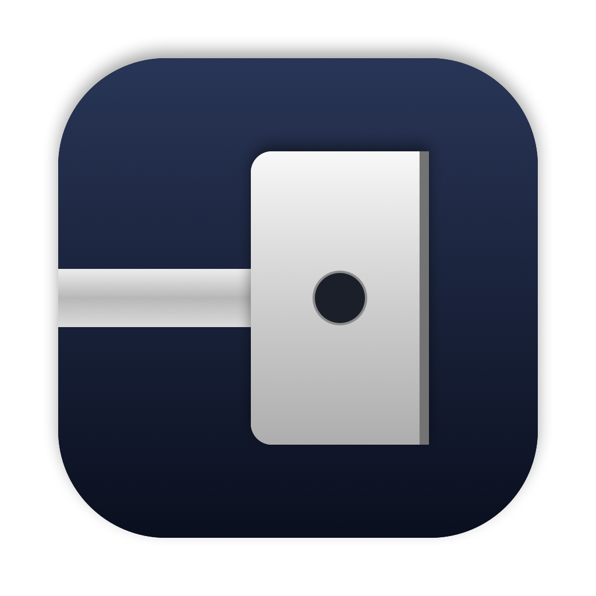

<p align="center">
  
</p>

<h1 align="center">DarkCharge</h1>

<p align="center"><b>Turn off the MagSafe charging light on your Mac.</b></p>

That little green or amber light on the MagSafe plug is bright enough to light up a
dark bedroom. DarkCharge is a tiny menu bar app that switches it off whenever your
MacBook's screen is dark, and lets it shine normally while you're using the Mac.

- **Automatic:** the LED goes dark when the lid is closed, the Mac is asleep, or the
  screen is off or dimmed all the way down. Or keep it off all the time.
- **Stays put** after plugging in, unplugging, sleep and restarts
- **Tiny and private:** no network access, no tracking, almost no CPU

## Requirements

- A MacBook with **MagSafe 3** (Apple Silicon MacBook Air and MacBook Pro, 2021 and later)
- macOS 14 Sonoma or later

Tested on a 16" MacBook Pro (M4 Pro). Reports from other models are welcome.

## Install

1. Download `DarkCharge.zip` from the [latest release](../../releases/latest) and unzip it.
2. Move **DarkCharge** to your Applications folder and open it.
3. Click the plug icon in the menu bar and check **Turn Off Charging LED**.
4. macOS asks you to allow DarkCharge's background helper once: in **System Settings →
   General → Login Items & Extensions**, turn on DarkCharge under *Allow in the
   Background*. No password, and nothing is installed outside the app.

### Using it

- **Turn Off Charging LED:** the main switch.
- **Whenever the screen is dark** (default): the LED is dark while
  - the lid is closed (also when you use the Mac closed with an external display),
  - the Mac is asleep,
  - the screen has gone to sleep, or
  - the brightness is turned all the way down,

  and shines normally while you're using the Mac.
- **Always:** the LED stays off all the time.
- **Launch at Login** (recommended), **Hide Menu Bar Icon** (open the app again to bring
  it back).

DarkCharge only controls the LED while the app is running. Quit it and the LED is back
to normal right away; that's also why **Launch at Login** is recommended.

## How it works

The LED is controlled by the Mac's System Management Controller (SMC), key `ACLC`.
Writing to it needs root, so DarkCharge brings a small helper, `DarkChargeHelper`, that
runs as a LaunchDaemon. It ships inside the app and is registered with Apple's
`SMAppService`, which is why macOS asks you to allow it once.

The app watches the built-in screen (only something in your login session can see it)
and sends the helper a heartbeat every few seconds with your settings and whether the
screen is dark. The helper turns the LED off when it should be: screen dark, lid closed,
just before the Mac sleeps, or always. It puts the LED back whenever macOS resets it,
for example on plugging in. When the heartbeats stop, because the app quit, crashed or
was deleted, the helper hands the LED back to macOS: at once on quit, otherwise within
half a minute.

Reading the built-in screen's brightness uses a private macOS API (there's no public one
on Apple Silicon); if a future macOS update breaks it, "dimmed all the way down" simply
stops counting as dark. The helper logs to the system log; to watch it:

```sh
/usr/bin/log stream --info --predicate 'subsystem == "com.darkcharge"'
```

## Uninstall

Choose **Uninstall DarkCharge…** from its menu. It gives the LED back to macOS, removes
the helper, and moves the app to the Trash. Simply deleting the app works too: the
helper lives inside it and goes with it.

## Build from source

Needs Xcode (Swift 6).

```sh
make app       # builds build.noindex/DarkCharge.app
make test      # runs the tests
make install   # copies the app into /Applications and starts it
```

The code is a Swift package:

- `Sources/DarkChargeCore`: shared by app and helper: SMC access, lid state, the
  heartbeat format, and the decision whether the LED should be off (`LEDPolicy`)
- `Sources/DarkChargeHelper`: the root helper
- `Sources/DarkCharge`: the menu bar app
- `Bundle/`: the app's Info.plist and the helper's LaunchDaemon plist
- `Tests/DarkChargeCoreTests`: tests for the heartbeat and `LEDPolicy`

To check the LED state from Terminal:

```sh
/Applications/DarkCharge.app/Contents/MacOS/DarkChargeHelper status
```

## Support

DarkCharge is free and open source. If it helps you sleep, you can
[buy me a coffee on Ko-fi](https://ko-fi.com/simonbross) ♥

## License

[MIT](LICENSE)
